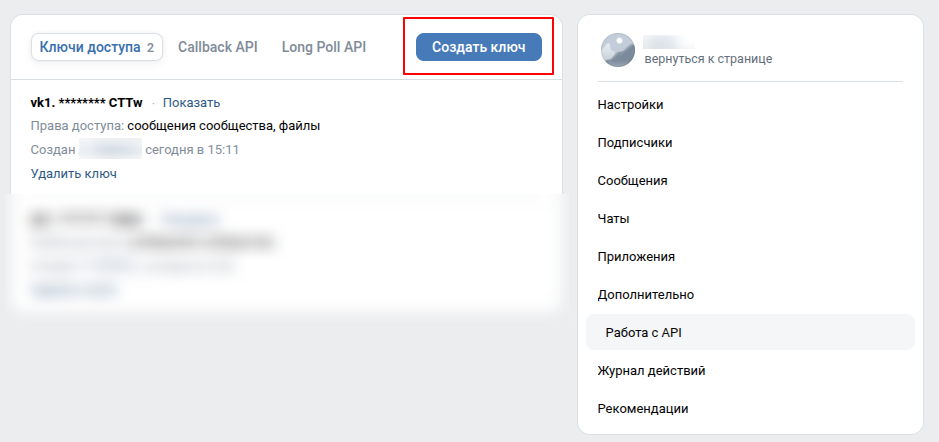

# Настройка VK бота

## 1. Создать ключ доступа VK

0. Создать сообщество.
1. Зайти в настройки сообщества: Управление -> Дополнительно
2. Подраздел Работа с API
3. Вкладка **Ключи доступа** -> нажмите кнопку "Создать ключ"
4. Отметить права:
   - Управление сообщениями
   - Управление документами
5. Создать, скопировать токен

## 2. Включить Long Poll API

Там же, Работа с API -> вкладка Long Poll API -> Включено

## 3. Ввести токен через деплоер

Запустить деплоер (в README сказано, как)

Выбрать язык. В меню выбрать пункт **Перенастроить панель** (пункт4). Деплоер последовательно спросит:

| Что спросит              | Что ввести                         |
| ------------------------ | ---------------------------------- |
| `Web port`               | Оставить по умолчанию или изменить |
| `SOCKS port range`       | Оставить по умолчанию              |
| `GHCR image prefix`      | Оставить по умолчанию              |
| `Use SELinux relabeling` | Оставить по умолчанию              |
| `Enable VK bot`          | **Ввести `y`**                     |
| `VK group token`         | **Вставить токен из п.1**          |

На вопрос о перезапуске согласиться (`Y`). Деплоер пересоберёт конфиг комоуза с VK-токеном и запустит стек. Не забудьте обновиться (пункт 3)

## 4. Авторизация

Бот будет запущен, но пока не будет авторизован. Для авторизации нужно написать боту сообщение в группе, он сам предложит авторизоваться. Далее следуйте инструкциям бота, они довольно просты.
